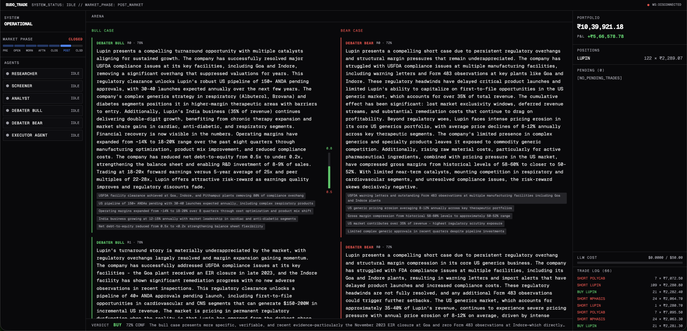
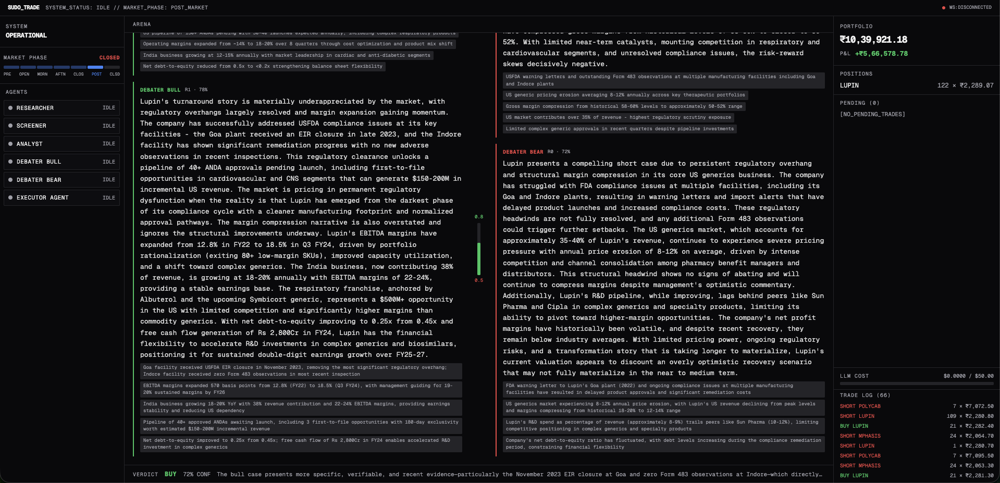
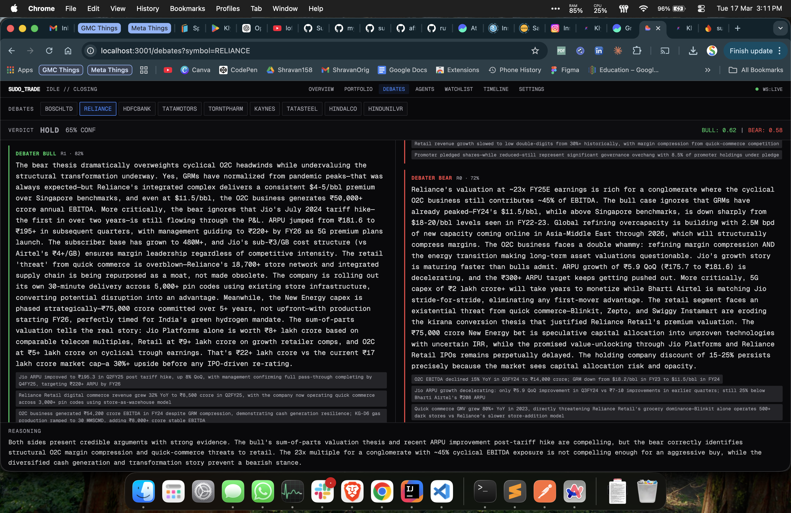
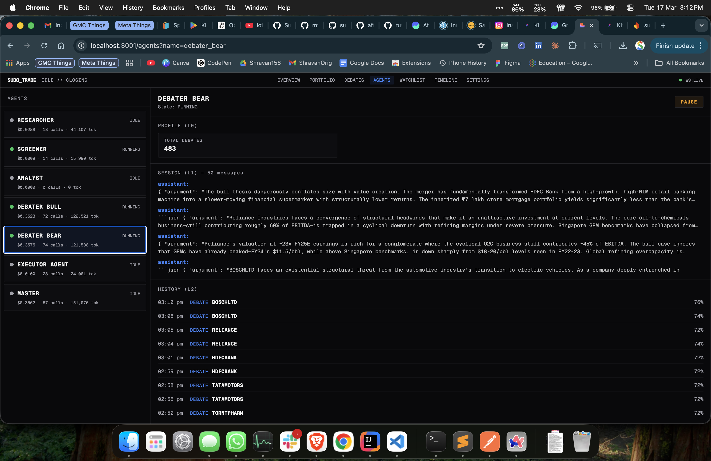
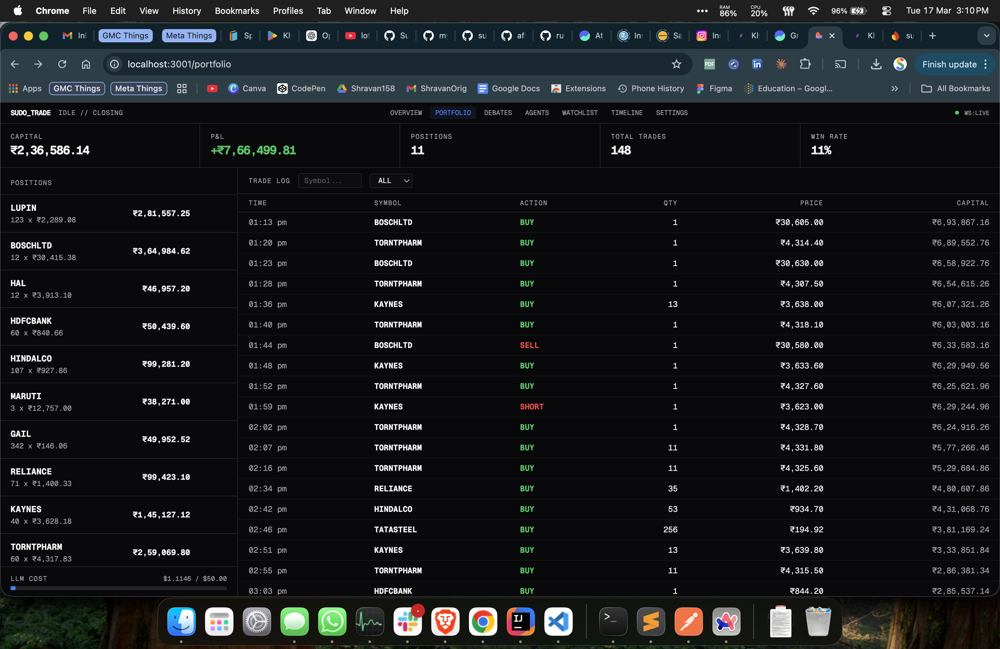
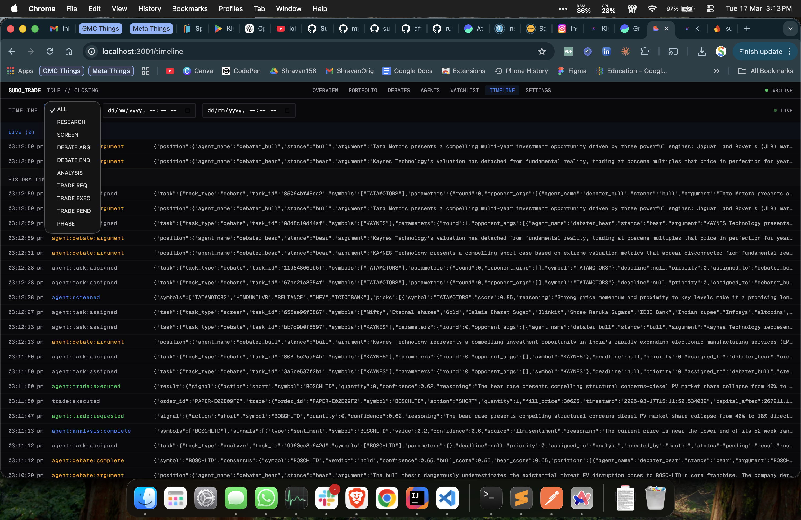
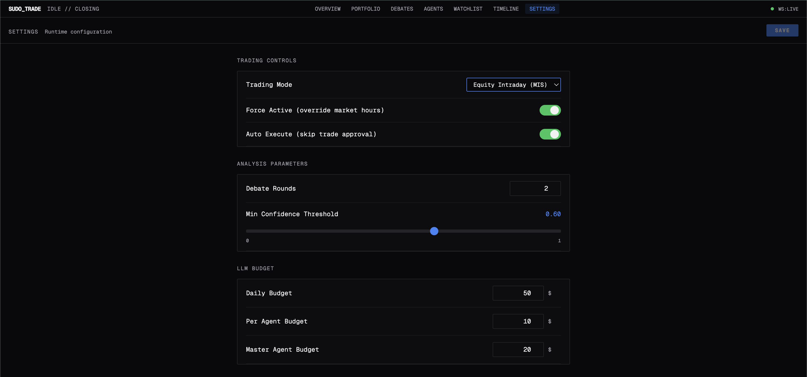

<div align="center">

# sudo-trade dashboard

**Real-time command center for an AI-powered trading system**

Watch autonomous agents research, debate, and trade Indian markets — live.

[](https://react.dev)
[](https://www.typescriptlang.org)
[](https://tailwindcss.com)
[](https://vitejs.dev)
[](https://www.framer.com/motion)

</div>

---





---

### Debates — Bull vs Bear AI Arguments



### Agents — Live Agent States & Activity



### Portfolio — Positions, Trades & P&L



### Timeline — Event Stream



### Settings — Runtime Configuration



---

## What is this?

This is the **frontend** for [sudo-trade](https://github.com/myselfshravan/sudo-trade) — a multi-agent AI trading system where LLM-powered agents autonomously research stocks, debate bull vs bear cases, reach consensus, and execute trades on Indian markets (NSE/BSE).

The dashboard is a real-time window into that system. Think Bloomberg Terminal meets AI agent observatory.

> **Note:** This UI requires the sudo-trade backend engine running. The engine is private — this dashboard alone won't do anything.

---

## Features

### System Pulse — Left Panel
- **Agent state monitoring** — see each AI agent (researcher, screener, debater, analyst, executor) with live status indicators and animated pulse dots
- **Market phase tracker** — visual 7-phase progress bar following NSE trading hours (Pre-Market → Opening → Morning → Afternoon → Closing → Post-Market → Closed)
- **Active debates** — accent-colored tags showing which stocks are currently being debated

### Debate Arena — Center Panel
- **Live bull vs bear arguments** — watch AI agents argue for and against a stock in real-time with multi-round rebuttals
- **Confidence meter** — vertical bar chart showing bull/bear score ratio with spring-physics animations
- **Evidence tags** — each argument backed by specific evidence (FDA clearances, earnings data, sector trends)
- **Consensus verdict** — final AI judge decision (strong_buy / buy / hold / sell / strong_sell) with confidence score and reasoning
- **Symbol tabs** — switch between multiple concurrent debates

### Ledger — Right Panel
- **Live portfolio** — capital, positions, P&L with INR currency formatting
- **Pending trade queue** — approve or reject AI-generated trade signals with one tap
- **LLM cost tracker** — daily budget usage bar showing spend across all agents
- **Trade log** — scrollable history of executed trades

### Real-Time Everything
- **WebSocket** connection with auto-reconnect for instant event streaming
- **Polling fallback** — TanStack Query with 3-5s intervals for state sync
- **Framer Motion** animations — spring-physics argument slides, pulse dots, layout transitions
- **WS status indicator** — green dot = LIVE, red = DISCONNECTED

---

## Architecture

```
                         +-----------------------+
                         |   sudo-trade engine   |
                         |   (private backend)   |
                         |                       |
                         |  6 AI Agents:         |
                         |  - Researcher          |
                         |  - Screener            |
                         |  - Debater (Bull)      |
                         |  - Debater (Bear)      |
                         |  - Analyst             |
                         |  - Executor            |
                         |                       |
                         |  :8080 HTTP + WS      |
                         +----------+------------+
                                    |
                           CORS / Vite Proxy
                                    |
                         +----------v------------+
                         |  sudo-trade-dashboard |
                         |   (this repo)         |
                         |                       |
                         |  React + TypeScript   |
                         |  Tailwind + shadcn/ui |
                         |  Framer Motion        |
                         |  TanStack Query       |
                         |                       |
                         |  :3001 Dev Server     |
                         +-----------------------+
```

The engine handles all intelligence. The dashboard is a read-only observer + trade approval interface.

---

## Agent Pipeline

The AI agents run a structured pipeline during market hours:

```
Research (news, filings, social)
    |
    v
Screen (quantitative + LLM ranking)
    |
    v
Debate (bull agent vs bear agent, multi-round)
    |
    v
Consensus (neutral judge scores arguments)
    |
    v
Analyze (sentiment + technical signals)
    |
    v
Execute (paper or live, with human approval gate)
```

Each step is visible in the dashboard in real-time.

---

## Tech Stack

| Layer | Tech |
|---|---|
| Framework | React 18, TypeScript 5.8 |
| Build | Vite 5 |
| Styling | Tailwind CSS 3.4, shadcn/ui (35+ Radix primitives) |
| Animations | Framer Motion 12 |
| Data | TanStack Query 5, native WebSocket |
| Charts | Recharts 2 |
| Icons | Lucide React |
| Testing | Vitest, Playwright, Testing Library |

---

## Operating Modes

| Mode | Config | Dashboard Behavior |
|---|---|---|
| **Autopilot** | `AGENT_AUTO_EXECUTE=true` | Pure monitoring — watch agents trade autonomously |
| **Manual** | `AGENT_AUTO_EXECUTE=false` | Approve/reject trades from the Ledger panel |
| **Force Active** | `AGENT_FORCE_ACTIVE=true` | Run outside market hours (weekends, holidays) |

---

## Setup

```bash
# Clone
git clone https://github.com/myselfshravan/sudo-trade-dashboard.git
cd sudo-trade-dashboard

# Install
bun install   # or npm install

# Dev server (port 3001)
bun dev       # or npm run dev
```

Set `VITE_API_URL` in `.env` to point to your engine instance, or the Vite proxy will route `/api/*` to the configured target.

---

<details>
<summary><h2>Engine API Reference</h2></summary>

The dashboard consumes the trading engine HTTP API at `http://localhost:8080`.

### HTTP Endpoints

#### GET `/status`

Full system status — agent states, market phase, active debates, LLM cost.

```json
{
  "master_state": "idle",
  "phase": "morning",
  "market_open": true,
  "active_debates": ["RELIANCE", "TCS"],
  "agents": {
    "researcher": { "state": "running" },
    "screener": { "state": "idle" },
    "analyst": { "state": "idle" },
    "debater_bull": { "state": "running" },
    "debater_bear": { "state": "idle" },
    "executor_agent": { "state": "idle" }
  },
  "cost": {
    "daily_budget": 50.0,
    "total_cost_usd": 0.1234,
    "agents": {
      "master": { "tokens": 5000, "cost_usd": 0.075, "calls": 2 },
      "researcher": { "tokens": 3000, "cost_usd": 0.03, "calls": 1 }
    }
  }
}
```

Agent states: `idle` | `running` | `waiting` | `error` | `stopped` | `rate_limited`

Market phases: `pre_market` | `opening` | `morning` | `afternoon` | `closing` | `post_market` | `closed`

---

#### GET `/portfolio`

Capital, positions, realized P&L, trade history.

```json
{
  "capital": 1039921.18,
  "positions": {
    "LUPIN": { "qty": 122, "avg_price": 2289.07 }
  },
  "pnl": 566578.78,
  "trades": [
    {
      "order_id": "PAPER-A1B2C3D4",
      "symbol": "LUPIN",
      "action": "BUY",
      "quantity": 21,
      "fill_price": 2285.80,
      "timestamp": "2026-03-16T14:30:45.123456",
      "capital_after": 451998.20
    }
  ],
  "total_trades": 66
}
```

---

#### GET `/signals`

All current analysis signals keyed by symbol.

```json
{
  "signals:RELIANCE": [
    {
      "type": "sentiment",
      "source": "llm_sentiment",
      "symbol": "RELIANCE",
      "value": 0.75,
      "confidence": 0.85,
      "reasoning": "Positive sentiment from recent earnings",
      "timestamp": "2026-03-16T14:30:45.123456"
    }
  ]
}
```

Signal value range: `-1.0` (very bearish) to `1.0` (very bullish).

---

#### GET `/consensus/{symbol}`

Debate verdict for a specific stock. Contains full bull/bear argument history.

```json
{
  "symbol": "LUPIN",
  "verdict": "buy",
  "confidence": 0.72,
  "bull_score": 0.78,
  "bear_score": 0.48,
  "reasoning": "Bull case presents more specific, verifiable evidence...",
  "positions": [
    {
      "agent_name": "debater_bull",
      "stance": "bull",
      "argument": "Lupin presents a compelling turnaround...",
      "confidence": 0.78,
      "evidence": ["USFDA facility clearance", "Pipeline of 150+ ANDAs"],
      "rebuttal_to": "",
      "round": 0
    },
    {
      "agent_name": "debater_bear",
      "stance": "bear",
      "argument": "Persistent regulatory overhangs...",
      "confidence": 0.72,
      "evidence": ["FDA warning letters", "US pricing erosion 8-12%"],
      "rebuttal_to": "",
      "round": 0
    }
  ],
  "timestamp": "2026-03-16T15:28:29.450430"
}
```

Verdicts: `strong_buy` | `buy` | `hold` | `sell` | `strong_sell`

---

#### GET `/pending`

Pending trade signals awaiting manual approval.

```json
{
  "pending": [
    {
      "action": "buy",
      "symbol": "RELIANCE",
      "quantity": 10,
      "confidence": 0.82,
      "reasoning": "Strong bull consensus with positive sentiment",
      "style": "intraday",
      "signals_used": [],
      "metadata": {}
    }
  ]
}
```

---

#### GET `/cost`

LLM cost tracking — per agent and daily total.

```json
{
  "daily_budget": 50.0,
  "total_cost_usd": 0.1234,
  "agents": {
    "master": { "tokens": 5000, "cost_usd": 0.075, "calls": 2 },
    "researcher": { "tokens": 3000, "cost_usd": 0.03, "calls": 1 }
  }
}
```

---

#### POST `/task`

Submit a task to the agent pipeline.

**Request:**
```json
{
  "type": "research|screen|debate|analyze",
  "symbols": ["RELIANCE", "TCS"]
}
```

| Type | What it does |
|---|---|
| `research` | Scan news, filings, social for symbols |
| `screen` | Quantitative + LLM ranking to find top picks |
| `debate` | Start bull vs bear debate on given symbols |
| `analyze` | Run sentiment + technical analysis on symbols |

**Response:**
```json
{
  "status": "accepted",
  "task_id": "abc123def456"
}
```

---

#### POST `/trade/approve/{idx}`

Approve pending trade at index for execution.

#### POST `/trade/reject/{idx}`

Reject pending trade at index.

---

### WebSocket `/ws`

Real-time event stream. Connect to `ws://localhost:8080/ws`.

All events follow this shape:
```json
{
  "event": "event_name",
  "data": {},
  "time": "2026-03-16T14:35:45.123456"
}
```

| Event | Data | Description |
|---|---|---|
| `agent:research:complete` | `{symbols, findings}` | Research scan finished |
| `agent:screened` | `{symbols}` | Stock screening picks |
| `agent:debate:argument` | `{agent_name, stance, symbol, argument, confidence, evidence, round}` | Debate argument |
| `agent:debate:complete` | `{symbol, consensus}` | Debate concluded with verdict |
| `agent:analysis:complete` | `{symbols, signals}` | Analysis signals generated |
| `agent:trade:requested` | `{signal}` | Trade signal from master |
| `agent:trade:executed` | `{result}` | Trade executed |
| `agent:trade:pending` | `{signal, pending_count}` | Trade queued for approval |
| `schedule:phase_change` | `{phase, old_phase, time}` | Market phase transition |

</details>

---

<div align="center">

Built for [sudo-trade](https://github.com/myselfshravan/sudo-trade)

</div>
