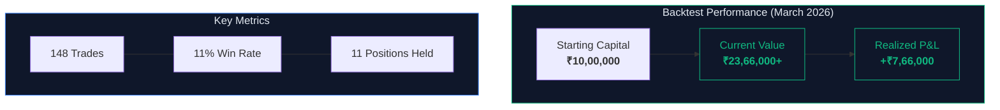
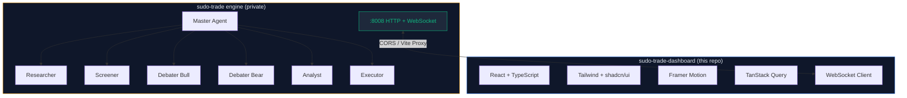

<div align="center">

# sudo-trade dashboard

**Real-time command center for an AI-powered trading system**

Watch autonomous agents research, debate, and trade Indian markets — live.

[](https://react.dev)
[](https://www.typescriptlang.org)
[](https://tailwindcss.com)
[](https://vitejs.dev)
[](https://www.framer.com/motion)

`6 AI Agents` | `Real-time WebSocket` | `Live P&L Tracking` | `Bull vs Bear Debates` | `NSE/BSE Markets`

</div>

---


---

## How It Works


> Every step in this pipeline is visible in the dashboard in real-time. The agents run autonomously during market hours — you just watch (or approve trades manually).

---

## Backtesting Results

Stress-tested over 10 days of high-volatility sessions during the India-Pakistan conflict escalation (March 2026). Markets swung wildly — the kind of environment that breaks most strategies.



> The system identified high-conviction entries during panic selling and timed exits on relief rallies. Bull vs bear debate mechanism proved especially valuable — forced the system to argue both sides before committing capital during uncertain geopolitical conditions.

---

## Pages

### Overview
Real-time debate arena with system pulse sidebar, live bull vs bear arguments, consensus verdicts, and trade ledger — the main command center during market hours.

### Portfolio
Capital summary cards (P&L, positions value, total trades, win rate), current holdings with quick close buttons, full trade log with symbol/action/price filtering, and LLM cost meter showing daily budget usage.

### Debates
Detailed debate transcripts — browse all debated stocks via symbol tabs, see verdict bar (BUY/SELL/HOLD with confidence %), bull and bear arguments with round numbers, evidence tags, and final consensus reasoning.

### Agents
Multi-agent inspection dashboard — live state indicators per agent (running, idle, error), LLM cost per agent (USD, tokens, calls), pause/resume controls, session state with conversation history, and time-series event logs.

### Watchlist
Custom stock tracking — add symbols, run batch actions (SCREEN ALL, RESEARCH ALL, DEBATE ALL, ANALYZE ALL), per-symbol action buttons on hover, draggable card grid.

### Timeline
Event stream with live WebSocket updates and historical replay — filter by event type (research, debate, trades, phase changes) and date range, color-coded event types with raw JSON payloads.

### Settings
Runtime configuration — trading mode (intraday/delivery/F&O), force active toggle, auto execute toggle, debate rounds, confidence threshold slider, LLM budget controls, and hard reset with confirmation dialog.

---

## Demo Screenshots

<details>
<summary><b>Debates — Bull vs Bear AI Arguments</b></summary>
<br/>


</details>

<details>
<summary><b>Agents — Live Agent States & Activity</b></summary>
<br/>


</details>

<details>
<summary><b>Portfolio — Positions, Trades & P&L</b></summary>
<br/>


</details>

<details>
<summary><b>Timeline — Event Stream</b></summary>
<br/>


</details>

<details>
<summary><b>Settings — Runtime Configuration</b></summary>
<br/>


</details>

---

## Architecture



The engine handles all intelligence. The dashboard is a real-time observer + trade approval interface.

---

## Market Phases

The system follows NSE trading hours with phase-based agent scheduling:

```mermaid
gantt
    title Daily Trading Schedule (IST)
    dateFormat HH:mm
    axisFormat %H:%M

    section Phases
    Pre-Market (Research)        :active, 09:00, 09:15
    Opening (Screen & Debate)    :active, 09:15, 09:30
    Morning (Execute & Monitor)  :crit,   09:30, 12:00
    Afternoon (Re-evaluate)      :active, 12:00, 14:00
    Closing (Exit Intraday)      :crit,   14:00, 15:30
    Post-Market (Daily Summary)  :active, 15:30, 16:00
```



---

## Tech Stack

### Dashboard (this repo)

| Layer | Tech |
|---|---|
| Framework | React 18, TypeScript 5.8 |
| Build | Vite 5 |
| Styling | Tailwind CSS 3.4, shadcn/ui (35+ Radix primitives) |
| Animations | Framer Motion 12 |
| Data | TanStack Query 5, native WebSocket |
| Charts | Recharts 2 |
| Icons | Lucide React |
| Testing | Vitest, Playwright, Testing Library |

### Engine (private)

The brain behind the dashboard. Built from scratch — no trading frameworks, no boilerplate.

<div align="center">

[](https://python.org)
[](https://docs.python.org/3/library/asyncio.html)
[](https://anthropic.com)
[](https://firebase.google.com)
[](https://modelcontextprotocol.io)

</div>

| Layer | Tech | Details |
|---|---|---|
| **Runtime** | Python 3.13, `uv` | Async-first, zero framework overhead |
| **Architecture** | Plugin system + EventBus | Everything swappable — brokers, LLMs, strategies, agents |
| **AI Agents** | 6 autonomous agents | Research → Screen → Debate → Consensus → Analyze → Execute |
| **LLM** | Per-agent routing | Different model/provider/key per agent (Claude, GPT, Gemini, local) |
| **Orchestration** | MCP (Model Context Protocol) | Claude Code drives the engine conversationally via stdio |
| **Brokers** | Groww (data), Kite (execution) | Multi-broker: one for market data, another for orders |
| **Persistence** | Firestore + local JSON | Paper state survives crashes, syncs across devices |
| **API** | aiohttp HTTP + WebSocket | 30+ endpoints, real-time event streaming |
| **Backtesting** | EventBus replay | Same strategy code runs live and in backtest — zero changes |
| **Cost Control** | Per-agent LLM budgets | Daily limits, per-model pricing, auto-gating on exhaustion |
| **Scheduling** | IST market phases | 6 phases, NSE holiday calendar, auto skip weekends |
| **Testing** | pytest + pytest-asyncio | 62 tests — agents, brokers, backtester, events |
| **CI** | GitHub Actions | Lint (ruff) + test on every push |

<details>
<summary><b>Engine by the numbers</b></summary>
<br/>

```
6   autonomous AI agents with distinct roles
30+ API endpoints (HTTP + WebSocket)
62  automated tests
6   market phases with IST scheduling
2   broker integrations (Groww data, Kite execution)
4   trade actions (BUY, SELL, SHORT, COVER)
∞   LLM providers (any OpenAI-compatible endpoint)
```

The engine is ~7,000 lines of Python. No Django, no FastAPI, no trading libraries. Pure asyncio + aiohttp + a custom plugin/event system. Every component — brokers, data providers, analyzers, LLM clients, strategies, executors, interfaces — implements a Protocol and registers as a plugin. Swap anything without touching the rest.

</details>

---

## Operating Modes

| Mode | Config | Dashboard Behavior |
|---|---|---|
| **Autopilot** | `AGENT_AUTO_EXECUTE=true` | Pure monitoring — watch agents trade autonomously |
| **Manual** | `AGENT_AUTO_EXECUTE=false` | Approve/reject trades from the Ledger panel |
| **Force Active** | `AGENT_FORCE_ACTIVE=true` | Run outside market hours (weekends, holidays) |

---

## Setup

```bash
# Clone
git clone https://github.com/myselfshravan/sudo-trade-dashboard.git
cd sudo-trade-dashboard

# Install
bun install   # or npm install

# Dev server (port 3001)
bun dev       # or npm run dev
```

Set `VITE_API_URL` in `.env` to point to your engine instance, or the Vite proxy will route `/api/*` to the configured target.

---

<details>
<summary><h2>Engine API Reference</h2></summary>

The dashboard consumes the trading engine HTTP API at `http://localhost:8008`.

### HTTP Endpoints

#### GET `/status`

Full system status — agent states, market phase, active debates, LLM cost.

```json
{
  "master_state": "idle",
  "phase": "morning",
  "market_open": true,
  "active_debates": ["RELIANCE", "TCS"],
  "agents": {
    "researcher": { "state": "running" },
    "screener": { "state": "idle" },
    "analyst": { "state": "idle" },
    "debater_bull": { "state": "running" },
    "debater_bear": { "state": "idle" },
    "executor_agent": { "state": "idle" }
  },
  "cost": {
    "daily_budget": 50.0,
    "total_cost_usd": 0.1234,
    "agents": {
      "master": { "tokens": 5000, "cost_usd": 0.075, "calls": 2 },
      "researcher": { "tokens": 3000, "cost_usd": 0.03, "calls": 1 }
    }
  }
}
```

Agent states: `idle` | `running` | `waiting` | `error` | `stopped` | `rate_limited`

Market phases: `pre_market` | `opening` | `morning` | `afternoon` | `closing` | `post_market` | `closed`

---

#### GET `/portfolio`

Capital, positions, P&L breakdown, trade history with per-trade P&L.

```json
{
  "capital": 1039921.18,
  "positions": {
    "LUPIN": { "qty": 122, "avg_price": 2289.07 },
    "INFY": { "qty": -50, "avg_price": 1580.00 }
  },
  "positions_value": 200565.54,
  "total_value": 1240486.72,
  "initial_capital": 500000.0,
  "realized_pnl": 566578.78,
  "unrealized_pnl": 0,
  "total_pnl": 740486.72,
  "pnl": 740486.72,
  "pnl_pct": 148.1,
  "trades": [
    {
      "order_id": "PAPER-A1B2C3D4",
      "symbol": "LUPIN",
      "action": "BUY",
      "quantity": 21,
      "fill_price": 2285.80,
      "pnl": 0,
      "timestamp": "2026-03-16T14:30:45.123456",
      "capital_after": 451998.20
    }
  ],
  "total_trades": 148,
  "total_sells": 66,
  "win_rate": 58.3
}
```

---

#### GET `/signals`

All current analysis signals keyed by symbol.

```json
{
  "signals:RELIANCE": [
    {
      "type": "sentiment",
      "source": "llm_sentiment",
      "symbol": "RELIANCE",
      "value": 0.75,
      "confidence": 0.85,
      "reasoning": "Positive sentiment from recent earnings",
      "timestamp": "2026-03-16T14:30:45.123456"
    }
  ]
}
```

Signal value range: `-1.0` (very bearish) to `1.0` (very bullish).

---

#### GET `/consensus/{symbol}`

Debate verdict for a specific stock. Contains full bull/bear argument history.

```json
{
  "symbol": "LUPIN",
  "verdict": "buy",
  "confidence": 0.72,
  "bull_score": 0.78,
  "bear_score": 0.48,
  "reasoning": "Bull case presents more specific, verifiable evidence...",
  "positions": [
    {
      "agent_name": "debater_bull",
      "stance": "bull",
      "argument": "Lupin presents a compelling turnaround...",
      "confidence": 0.78,
      "evidence": ["USFDA facility clearance", "Pipeline of 150+ ANDAs"],
      "rebuttal_to": "",
      "round": 0
    },
    {
      "agent_name": "debater_bear",
      "stance": "bear",
      "argument": "Persistent regulatory overhangs...",
      "confidence": 0.72,
      "evidence": ["FDA warning letters", "US pricing erosion 8-12%"],
      "rebuttal_to": "",
      "round": 0
    }
  ],
  "timestamp": "2026-03-16T15:28:29.450430"
}
```

Verdicts: `strong_buy` | `buy` | `hold` | `sell` | `strong_sell`

> Positions can have negative `qty` for short positions (e.g. `{"qty": -50, "avg_price": 1580.00}`).

---

#### GET `/pending`

Pending trade signals awaiting manual approval.

```json
{
  "pending": [
    {
      "action": "buy",
      "symbol": "RELIANCE",
      "quantity": 10,
      "confidence": 0.82,
      "reasoning": "Strong bull consensus with positive sentiment",
      "style": "intraday",
      "signals_used": [],
      "metadata": {}
    }
  ]
}
```

---

#### GET `/cost`

LLM cost tracking — per agent and daily total.

```json
{
  "daily_budget": 50.0,
  "total_cost_usd": 0.1234,
  "agents": {
    "master": { "tokens": 5000, "cost_usd": 0.075, "calls": 2 },
    "researcher": { "tokens": 3000, "cost_usd": 0.03, "calls": 1 }
  }
}
```

---

#### POST `/task`

Submit a task to the agent pipeline.

**Request:**
```json
{
  "type": "research|screen|debate|analyze",
  "symbols": ["RELIANCE", "TCS"]
}
```

| Type | What it does |
|---|---|
| `research` | Scan news, filings, social for symbols |
| `screen` | Quantitative + LLM ranking to find top picks |
| `debate` | Start bull vs bear debate on given symbols |
| `analyze` | Run sentiment + technical analysis on symbols |

**Response:**
```json
{
  "status": "accepted",
  "task_id": "abc123def456"
}
```

---

#### POST `/trade/approve/{idx}`

Approve pending trade at index for execution.

#### POST `/trade/reject/{idx}`

Reject pending trade at index.

---

#### GET/POST `/config`

Read or update runtime configuration (trading mode, budgets, thresholds).

```json
{
  "TRADING_MODE": "equity_intraday",
  "AGENT_FORCE_ACTIVE": true,
  "AGENT_AUTO_EXECUTE": false,
  "AGENT_DEBATE_ROUNDS": 2,
  "AGENT_DAILY_BUDGET_USD": 50.0,
  "AGENT_MIN_CONFIDENCE": 0.6
}
```

---

#### Watchlist CRUD

| Method | Endpoint | Description |
|---|---|---|
| `GET` | `/watchlist` | Get current watchlist symbols |
| `POST` | `/watchlist` | Set entire watchlist `{"symbols": [...]}` |
| `PUT` | `/watchlist/{symbol}` | Add symbol to watchlist |
| `DELETE` | `/watchlist/{symbol}` | Remove symbol from watchlist |

---

#### Agent Inspection

| Method | Endpoint | Description |
|---|---|---|
| `GET` | `/agents` | All agents with state + profile |
| `GET` | `/agents/{name}/profile` | Agent's cumulative stats |
| `GET` | `/agents/{name}/history` | Event log (filterable by `?type=&symbol=&limit=`) |
| `GET` | `/agents/{name}/session` | Current session state + messages |
| `POST` | `/agents/{name}/pause` | Pause an agent |
| `POST` | `/agents/{name}/resume` | Resume a paused agent |

---

#### Other Endpoints

| Method | Endpoint | Description |
|---|---|---|
| `GET` | `/timeline` | Event timeline (filterable by `?type=&from=&to=&limit=`) |
| `GET` | `/quotes?symbols=X,Y` | Live quotes from broker |
| `GET` | `/research` | Latest research findings |
| `POST` | `/positions/{symbol}/close` | Close a position (SELL for long, COVER for short) |
| `POST` | `/reset` | Hard reset — clear all trades, positions, P&L `{"capital": 500000}` |

---

### WebSocket `/ws`

Real-time event stream. Connect to `ws://localhost:8008/ws`.

All events follow this shape:
```json
{
  "event": "event_name",
  "data": {},
  "time": "2026-03-16T14:35:45.123456"
}
```

| Event | Data | Description |
|---|---|---|
| `agent:research:complete` | `{symbols, findings}` | Research scan finished |
| `agent:screened` | `{symbols}` | Stock screening picks |
| `agent:debate:argument` | `{agent_name, stance, symbol, argument, confidence, evidence, round}` | Debate argument |
| `agent:debate:complete` | `{symbol, consensus}` | Debate concluded with verdict |
| `agent:analysis:complete` | `{symbols, signals}` | Analysis signals generated |
| `agent:trade:requested` | `{signal}` | Trade signal from master |
| `agent:trade:executed` | `{result}` | Trade executed |
| `agent:trade:pending` | `{signal, pending_count}` | Trade queued for approval |
| `schedule:phase_change` | `{phase, old_phase, time}` | Market phase transition |

</details>

---

<div align="center">

Built for [sudo-trade](https://github.com/myselfshravan/sudo-trade)

</div>
